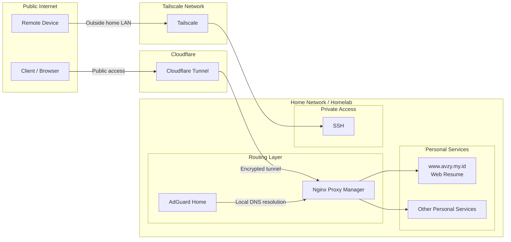

<h1>
  
  Hey! Nice to see you.
</h1>

  Welcome to my page! 
  I'm <b>Akhmad Fauzy</b>, a software engineer from
  
  <b>Indonesia</b>.

  I build web, mobile, and backend systems — while trying to automate anything repetitive.

<h3>Things I code with</h3>

  
  
  
  
  
  
  

<h3>Things I find interesting</h3>

  Backend engineering · Automation · Go · Self-hosting · Software architecture

  Occasionally maintaining a homelab that started from “just one service.”

<h3>Homelab Architecture</h3>

<h3>Where to find me</h3>

  <a href="https://linkedin.com/in/auzy">LinkedIn</a> ·
  <a href="https://www.avzy.my.id">Web</a>

